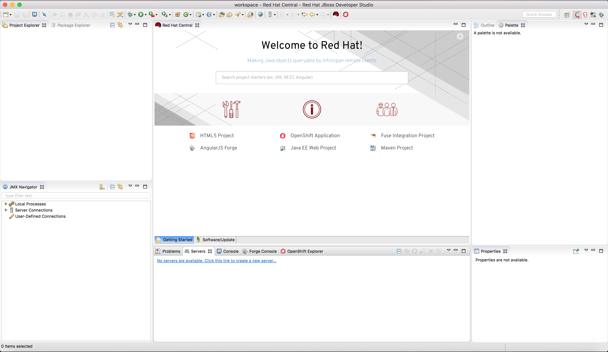

# Fun with JBoss Forge
So if you're like me, messaging and integration are bread and butter
but building web user interfaces is daunting with a steep learning
curve to just get started.  Fret no more!  [JBoss Forge](https://forge.jboss.org/),
built into JBoss Developer Studio (for quite some time actually)
and also as an open source project, automates the generation of
code scaffolding to provide a basic, but functional web application
backed by a database.  With very little effort on your part.

## Let's Get Started
The scripts I use were all tested and verified on Mac OSX with the
[Homebrew](https://brew.sh/) package manager.  You'll need to adjust
the scripts to work with an alternative platform.

### Get the binaries
Review the [README.md](dist/README.md) file in the dist folder and
make sure you have all the prerequisite files available.  This
project will run JBoss Enterprise Application Platform standalone,
so you'll be installing it locally on your laptop or workstation.

### Review the Configuration
Take a look at the `demo.conf` file and make any modifications
needed for your environment.  File and patch versions in the
`demo.conf` file should match the versions of files in the `dist`
directory.  Make sure these are in agreement.  If you leave the
defaults, you should be fine.

### Configure the database
Run the following command to make sure that PostgreSQL is started
and has the appropriate database and user.  This script does take
advantage of `brew services` so you'll need to adjust for an
alternative operating system.

    ./init-postgresql.sh

This script creates no tables, but only establishes a database and
user.

### Install EAP
The following script will install EAP, apply the latest patch,
configure the JDBC driver, and configure and bind a JNDI datasource
needed by our application.

    ./install.sh

### Install JBDS
Install JBoss Developer Studio by running the command below and
following prompts in the installation wizard:

    java -jar dist/devstudio-11.3.0.GA-installer-standalone.jar

## Let's Have Some Fun!
With everything installed, we're ready to have some fun with forge!

### Launch and Configure JBDS
Launch JBoss Developer Studio.  How to do this will vary by operating
system, but on OSX, I simply click the `devstudio` icon in my
`Applications` folder.

Select "Yes, Ok, whatever" to any pop-up windows and prompts and,
under a minute or so, you'll have the default "JBoss" perspective
open.

Let's set up a runtime to point to the EAP instance we just installed.
In the bottom central pane, click on the link "No servers are
available.  Click this link to create a new server..." and then
follow the prompts.  In the first dialog box, select EAP 7.1 as the
server type and leave the other fields as-is.  Press "Next".

If you're presented with a JBoss Runtime dialog, click "Browse..."
and make sure that the home directory points to where you installed
EAP 7.1 (it should resemble `/some/path/to/jboss-eap-7.1`).  Leave
the defaults for other fields and click "Finish".

### Start EAP
On the "Servers" tab in the bottom center pane, right-click on
"JBoss EAP 7.1 ..." and select "Start".  EAP should start in under
ten seconds.

